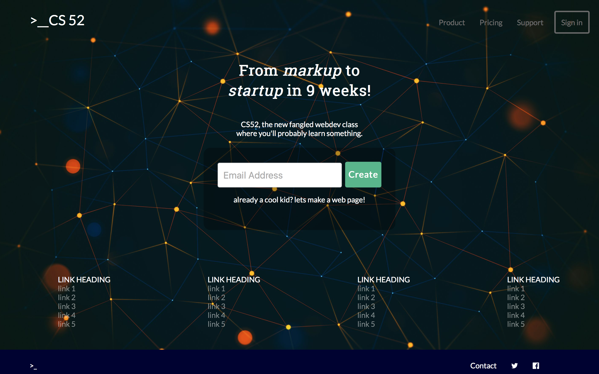
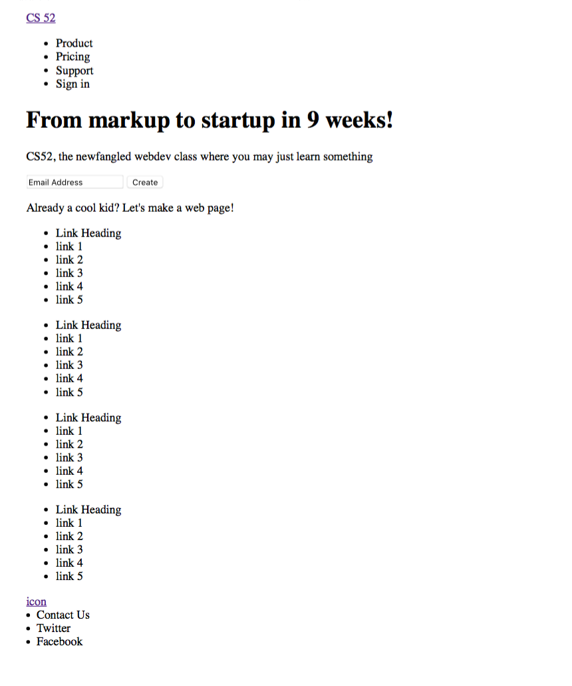

# README: *slack-landing-page* 
_____

**Ahsan Azim, July 2016**

<!---->

This project represents a website that, in its design, imitates that of **Slack**'s landing page - which is accessible at ``slack.com``.

All links and tabs are currently empty, as the construction of this page was simply an endeavour in imitating a modern and successfull design style. 

Part of the challenge was that I tried to maximise the website's responsiveness while restricting myself to only ``html`` and ``CSS``. Zero Javascript was used. Such an approach required myriad workarounds, some of which will become clear in the *Extensions* section at the bottom of this page.

## Usage:

The web page is accessible at 

- ``clever-camera.surge.sh``,
- prefferably on a latest-version (w.r.t. July 2016) Google Chrome browser. 

Although it may load and 'work' on previous versions and other platforms, thorough testing has not been done on said platforms. 

## Developmental notes:

- At its earliest stage, the website started out as a simple html file, which looked like the following when rendered:

<!---->

- Slack's font of choice (*Lato* - ``https://www.google.com/fonts/specimen/Lato``) was used throughout
- The backgrounds used - both the main background and that of the contracted version's menu page - are shown below. They were selected for their contrasting color schemes, and because I like them :)

<!---->

**img**: *the main background*

<!---->

**img**: *the phone menu background - note that only a subset of it actually appears when navigating the phone menu*

## Design features of note:

Some specific design features, I feel, are worth pointing out in particular:

- *responsive screen-size and design*: when moving to a sub-640px screen size, the web page not only resizes in a bug-free way, but also alters the design susbstanially. This is meant to create a more mobile-friendly look:
- box shadow and color change when hovering on items of note.
- the font choice (Lato) is again relevant here. 

## EXTENSIONS:

I have implemented the following two official extensions:

- CSS Checkbox Hack for the mobile version Menu (reference ``https://css-tricks.com/the-checkbox-hack/`` for a detailed description of the hack)
- Fancy CSS transition

I also made the pop-up menu somewhat stylized:

- a darker colored version of the main background is set as the pop-up background, 
- box shadow implemented upon hovering over pop-up menu items

The following should suffice as a demonstration of all of the aforementioned behaviour:

<!---->
